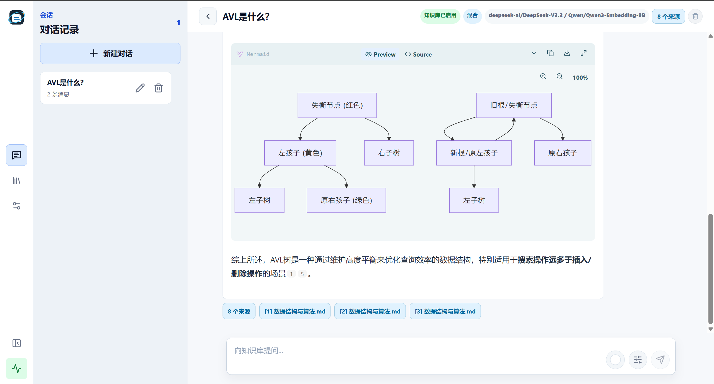
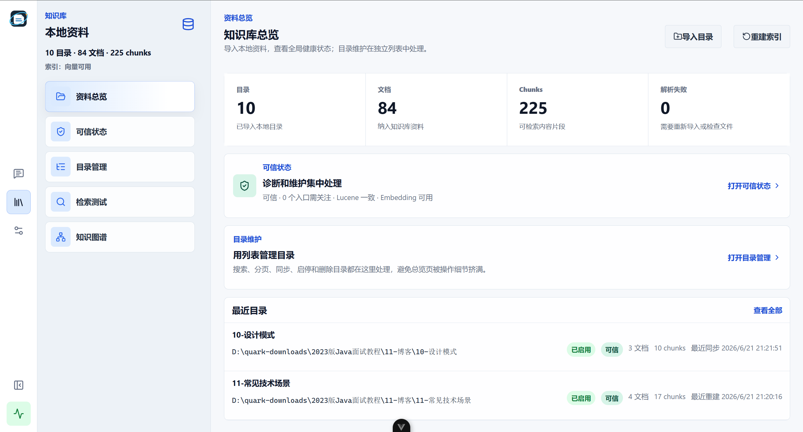
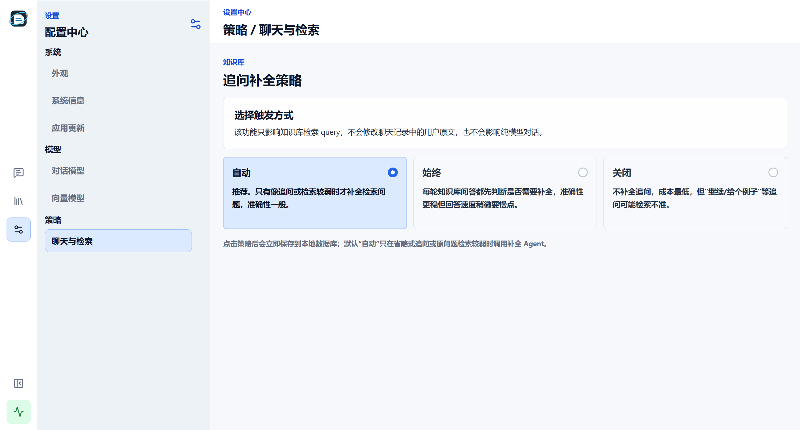
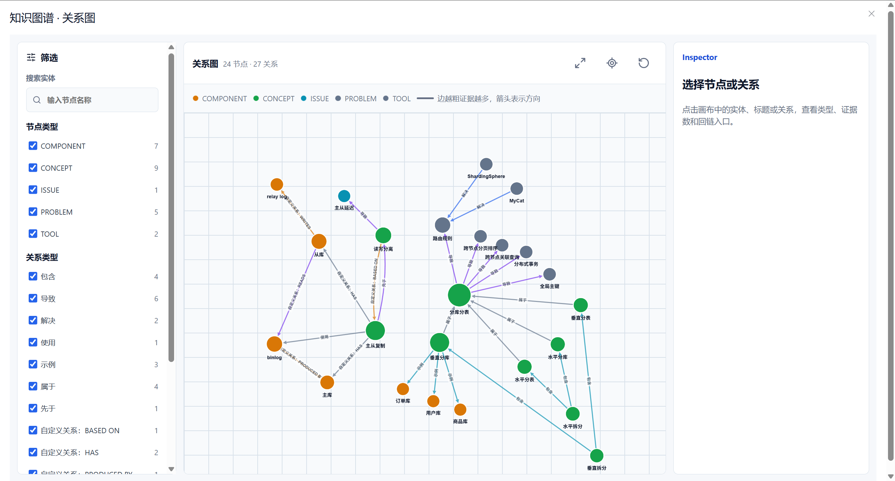

<p align="center">
  
</p>

# 知记空间（CogniNote）

知记空间（CogniNote）是一个本地优先的个人知识库问答应用。它可以导入本机 Markdown、TXT、DOCX 和文本型 PDF，使用 SQLite 保存知识片段，使用 Lucene 建立关键词/向量混合检索索引，并通过可配置的大模型提供带引用来源的 RAG 问答。

当前项目面向本地桌面交付：Tauri 负责桌面窗口、后端进程生命周期、桌面会话令牌和自动更新检查，Spring Boot 负责业务 API 和托管 Vue 页面。中文显示名是“知记空间”，英文工程名、安装包名、数据目录和兼容标识继续保留 `CogniNote`。Windows 与 macOS 打包链路分开维护，避免平台资源和脚本互相污染。

适合的使用场景：

- 把本地笔记、项目文档和资料整理成可检索知识库。
- 对自己的文档提问，并要求答案带来源引用。
- 在本机运行 RAG 应用，不把文档上传到托管知识库平台。

## 下载与体验

测试版和后续正式版都会通过 [GitHub Releases](https://github.com/ItQianChen/cogninote-agent-design/releases) 分发。当前 `0.1.50` 定位为可安装测试分发版；发布 `v0.1.50-test.1` 后，优先从 Releases 下载对应平台安装包体验。

> 预发行测试包默认未签名，适合内部测试和小范围试用；正式版发布后优先推荐 signed / notarized 安装包。

| 平台 | 推荐下载 | 说明 |
| --- | --- | --- |
| Windows x64 | `CogniNote-0.1.50-windows-x64-unsigned-installer.exe` | 可能出现未知发布者或 SmartScreen 提示；便携版可选择 `CogniNote-0.1.50-windows-x64-unsigned-portable.zip` |
| macOS Apple Silicon | `CogniNote-0.1.50-macos-arm64-unsigned.dmg` | 未签名测试包可能被 Gatekeeper 拦截；如遇拦截，先参考 Release 说明或 [桌面构建指南](docs/desktop-build-guide.md) 处理 |


## 快速使用

1. 下载并安装对应平台的桌面包。
2. 打开应用，在“设置”页选择 Provider，填写 API Key，并分别配置 Chat / Embedding 模型。
3. 在“知识库总览”中通过导入弹窗导入本地文档目录。
4. 在资料总览页查看知识库健康状态；需要批量维护时进入“目录管理”列表，按名称、路径或状态搜索目录，并把同步、停用、删除或重建索引加入维护队列。
5. 使用搜索面板验证索引命中结果。
6. 回到“对话”页提问，查看带引用来源的流式回答；需要追问某段助手回复时，选中文本并点击“添加到对话”。

模型配置细节见 [模型配置指南](docs/model-configuration-guide.md)。

## 界面预览

<p align="center">
  
</p>
<p align="center">
  
</p>

<details>
<summary>更多截图</summary>

<p align="center">
  
</p>
<p align="center">
  
</p>

</details>

## 核心能力

- 本地文档导入：支持 Markdown、TXT、DOCX、文本型 PDF。
- 知识库目录管理：总览页保持轻量入口，目录维护在独立列表中完成；支持导入弹窗、模糊搜索、启停/问题筛选、分页查找、文件同步、启用/停用、删除目录、局部重建索引和按目录展开文档。
- 知识库问答可用性诊断：资料总览页展示“问答可用性”入口，聚合资料同步状态、可检索文档数、Lucene 一致性、Embedding 降级、图谱过期、重复内容和疑似版本冲突；停用目录显示为 `DISABLED`，作为用户主动排除检索范围的状态，不计入问题数量或全库告警。点击“查看问题”会先列出全局问题和问题目录，再进入诊断与修复抽屉执行同步重试、重建索引、配置向量模型、查看图谱或复制路径等修复动作。
- 知识库维护队列：导入目录、同步目录、启停、删除、目录重建和全库重建都会先进入本地 FIFO 队列，通过 SSE 推送 `QUEUED/RUNNING/COMPLETED/FAILED` 等状态；等待任务可取消，运行任务执行到安全完成点。高风险操作先二次确认，导入和重建类任务完成后会弹出需要用户确认的结果提示。
- 本地数据存储：SQLite 保存文档元数据、chunk 内容、知识库维护队列与历史、模型配置、聊天会话、消息和用户引用的助手回复片段。
- 本地搜索索引：Lucene 提供 BM25 关键词检索、向量检索和混合检索；支持中文正文、代码标识符、路径片段和流程图节点检索，向量检索会使用 active Embedding 模型生成查询向量。
- RAG 对话：通过 Spring AI ChatClient + Advisor 注入会话记忆和知识库片段；知识库模式可按 `AUTO/ALWAYS/OFF` 策略补全省略、指代、动作型和领域切换追问的检索 query，并保留空白的 SSE 流式输出答案、展示引用来源；模型截断、异常或流提前断开时会标记“未完成”，避免半截回答伪装成完成。
- 知识图谱：基于已导入 chunks 调用 active Chat 模型抽取实体、中文关系谓词、关系描述和证据，写入 SQLite 图谱缓存与派生视图；进入图谱页先展示可搜索、可筛选的已有全库/目录/文件图谱清单，点击“查看”后才按需加载完整视图；已有图谱可重新生成或删除，删除只清理图谱节点、关系、证据、视图和运行记录，不删除原始目录、文件、chunks 或 chunk 抽取缓存；关系 `type` 只做内部粗分类，画布、邻接表、Inspector 和证据抽屉直接展示后端校验后的中文 `displayLabel` 与 `description`。
- 模型配置：支持阿里百炼 DashScope 默认通道，也支持 OpenAI-compatible 自定义 Base URL；Chat 模型可配置上下文窗口，默认 `128K`。
- Prompt 配置：聊天、RAG、追问补全、连接测试和知识图谱抽取 Prompt 统一放在 `src/main/resources/cogninote-prompts.yaml`；`application.yaml` 只导入该专用配置文件并保留运行配置。
- 对话式桌面界面：左侧持久化会话列表，主区域流式对话，答案按 AI 流式 Markdown 渲染并支持 Mermaid 流程图代码块，引用来源可折叠；用户可选中已完成助手回复片段添加到下一轮对话，发送后引用标签会随用户消息持久化并支持悬停预览；对话设置可切换知识库、检索模式和 Top K，发送区显示当前会话上下文占用和压缩状态。
- 主题设置：支持深色/夜间和日间主题，本机保存偏好。
- 桌面交付：提供 Windows NSIS 安装包、便携包，以及 macOS Apple Silicon `.app` / `.dmg` 打包链路；桌面模式下所有 `/api/**` 请求都使用 Tauri 启动期本机会话令牌保护，设置页支持 stable/preview 更新通道和 GitHub Release manifest 检查。签名、公证、Release tag 和安装升级细节见 [桌面构建指南](docs/desktop-build-guide.md)。

## 技术栈

| 模块 | 技术 |
| --- | --- |
| 后端 | Java 25, Spring Boot 3.5, MyBatis XML Mapper |
| 前端 | Vue 3, Vue Router, Pinia, Vite, Element Plus |
| 存储 | SQLite |
| 检索 | Apache Lucene |
| 模型 | Spring AI Alibaba DashScope, Spring AI OpenAI Runtime for OpenAI-compatible |
| 桌面 | Tauri 2, jlink, jpackage, NSIS, macOS app/dmg |

## 开发者快速开始

### 环境要求

- JDK 25，桌面打包必须使用包含 `jlink` 和 `jpackage` 的完整 JDK
- Maven 3.9+
- Node.js 20.19.6 或兼容版本
- npm 10.8.2 或兼容版本

Windows 桌面打包还需要 Rust stable toolchain、MSVC Build Tools 和 WebView2 Runtime。macOS 桌面打包第一版只支持 Apple Silicon，需要 JDK 25 arm64、Rust stable 和 Xcode Command Line Tools。完整的桌面打包、签名、公证和故障排查见 [桌面构建指南](docs/desktop-build-guide.md)。

项目会通过 Maven Enforcer 校验 JDK 25，低版本会直接构建失败。Windows 下可先设置：

```powershell
$env:JAVA_HOME='D:\CodeApps\Java-JDK\jdk-25.0.2'
$env:Path="$env:JAVA_HOME\bin;$env:Path"
```

### 启动后端

```powershell
mvn spring-boot:run '-Dspring-boot.run.profiles=dev'
```

默认地址：

```text
http://127.0.0.1:18080
```

首次启动会创建本地数据目录：

```text
%APPDATA%\CogniNote\
```

### 启动前端开发环境

```powershell
cd cogniNote-agent-front
npm ci
npm run dev
```

Vite 会把 `/api` 代理到 `http://127.0.0.1:18080`。

### 构建整包 Jar

```powershell
mvn clean -Pwith-frontend package
java -jar target/cogninote-agent-design.jar
```

`with-frontend` profile 会构建 Vue，并把 `cogniNote-agent-front/dist` 复制进 Spring Boot 静态资源目录。手动切换版本或验证前端静态资源时建议带 `clean`，避免旧 Vite hash 文件残留在 `target/classes/static`。

### 更新发布版本号

发布前更新版本号请使用白名单脚本，避免全局替换误改第三方锁文件：

```powershell
.\scripts\update-release-version.ps1 0.1.50
```

### 构建 Windows 桌面应用

```powershell
.\scripts\build-desktop-app.ps1 -SkipTests
```

构建完成后主要产物为：

```text
cogniNote-agent-front/src-tauri/target/release/cogninote-agent.exe
cogniNote-agent-front/src-tauri/target/release/bundle/nsis/CogniNote_0.1.50_x64-setup.exe
```

注意：`target/desktop/backend/CogniNoteBackend/CogniNoteBackend.exe` 只是后端 app-image 的启动器，不是最终桌面应用入口。

GitHub Actions 发布、签名证书、默认 Release tag 和安装升级清理策略见 [桌面构建指南](docs/desktop-build-guide.md)。

### 构建 macOS 桌面应用

macOS 和 Windows 打包链路分开维护。请在 Apple Silicon Mac 上执行：

```bash
bash ./scripts/build-desktop-app-macos.sh --skip-tests
```

构建完成后主要产物为：

```text
cogniNote-agent-front/src-tauri/target/release/bundle/macos/CogniNote.app
cogniNote-agent-front/src-tauri/target/release/bundle/dmg/CogniNote_0.1.50_aarch64.dmg
```

注意：`target/desktop-macos/backend/CogniNoteBackend.app` 只是 macOS 后端 app-image，不是最终桌面应用入口。

GitHub Actions 发布、签名公证、默认 Release tag 和 macOS 安装替换策略见 [桌面构建指南](docs/desktop-build-guide.md)。

## 数据与隐私

知记空间默认继续把数据写入英文工程目录：

```text
%APPDATA%\CogniNote\
  data\cogninote.db
  index\lucene\
  logs\app.log
  logs\desktop-backend.log
```

macOS 桌面版默认写入：

```text
~/Library/Application Support/CogniNote/
  data/cogninote.db
  index/lucene/
  logs/app.log
  logs/desktop-backend.log
```

SQLite 是业务事实来源，Lucene 是可重建索引。应用不会复制用户原始文件，只保存解析后的 chunk 文本、文档元数据、知识库维护队列与历史、聊天记录、知识图谱事实与视图缓存、图谱运行记录、索引数据和模型配置。健康状态由 SQLite 当前事实和轻量文件系统探针即时计算，不额外保存一份容易过期的健康表。用户删除知识库目录时，只删除应用内目录、文档、chunks、索引、图谱派生数据和该目录维护记录，不触碰本地原始文件；用户删除某个已有知识图谱时，只删除该 scope 的图谱派生数据和运行记录，不触碰原始资料或可复用的 chunk 抽取缓存。

`app.log` 是 Spring Boot 业务日志，`desktop-backend.log` 是桌面壳启动后端时的 stdout/stderr 日志。定位桌面启动、模型连接、RAG 对话和索引问题时优先查看这两个文件。

日志分为三档：默认发布配置为 `INFO`，不落盘 Spring AI prompt/completion；本地开发使用 `dev` profile 保持详细日志；用户问题排查可临时启用 `diagnostic` profile。桌面安装包会自动带 `desktop` profile，Spring Boot 业务日志只写滚动 `app.log`，避免控制台日志重复撑大 `desktop-backend.log`。

API Key 当前仍明文保存到本机 SQLite，适合内部测试和小范围安装验证，不建议作为大范围公开生产发布。桌面本机 API 已通过启动期会话令牌保护，公开发布前仍应改为 Windows 本地加密或系统凭据管理保存 API Key。

## 架构概览

```text
Tauri Desktop Shell
  ├─ generates desktop session token
  ├─ checks GitHub Pages updater manifests
  └─ loads http://127.0.0.1:{port}/

Spring Boot Backend
  ├─ Desktop Session Token Filter (/api/**)
  ├─ Document Ingestion
  ├─ Repository + MyBatis Mapper
  ├─ Lucene Knowledge Store
  ├─ Knowledge Health Diagnostics
  ├─ Knowledge Maintenance Queue + SSE
  ├─ Model Configuration
  ├─ AI Runtime
  ├─ Chat Memory
  ├─ Knowledge Graph
  └─ Agent Chat SSE (Whitespace Preserving + Completion Guard)

Vue Frontend
  ├─ Chat Shell
  ├─ Persistent Sessions
  ├─ Knowledge Workbench
  ├─ Knowledge Directory Manager
  ├─ Knowledge Maintenance Store
  ├─ Knowledge Health Drawer
  ├─ AI Streaming Markdown Renderer
  └─ Settings Center
      ├─ System & Theme
      ├─ App Update Channel
      ├─ Knowledge & Search Test
      └─ Chat / Embedding Model Config
```

后端按 controller / service / repository / domain / dto 分层；前端按 router / stores / api / views / components 分层。完整设计见 [项目方案](docs/cogninote-agent-design.md)。

## 常用命令

```powershell
# 后端测试
mvn test

# 后端开发运行，启用详细诊断日志
mvn spring-boot:run '-Dspring-boot.run.profiles=dev'

# 前端构建
npm --prefix cogniNote-agent-front run build

# 后端 + 前端整包
mvn clean -Pwith-frontend package

# 桌面工具链检查
.\scripts\verify-desktop-toolchain.ps1

# 桌面应用打包
.\scripts\build-desktop-app.ps1 -SkipTests

# macOS Apple Silicon 桌面应用打包
bash ./scripts/build-desktop-app-macos.sh --skip-tests
```

## 文档

| 文档 | 内容 |
| --- | --- |
| [项目方案](docs/cogninote-agent-design.md) | 产品定位、架构、数据模型和里程碑 |
| [API 参考](docs/api-reference.md) | REST API、统一响应格式、SSE 事件和流式取消接口 |
| [模型配置指南](docs/model-configuration-guide.md) | DashScope 与 OpenAI-compatible 配置方式 |
| [桌面构建指南](docs/desktop-build-guide.md) | 桌面打包、签名、公证、发布和故障排查 |
| [第 32 阶段可信状态加固计划](docs/phase-32-knowledge-health-p0-hardening-plan.md) | Lucene 一致性、Embedding 降级提示、删除清理和前端控制台 |
| [第 33 阶段维护队列计划](docs/phase-33-knowledge-maintenance-queue-plan.md) | 维护任务队列、SSE 状态、确认弹窗、完成提示和 SQLite 连接约束 |
| [第 34 阶段问答可用性诊断计划](docs/phase-34-knowledge-answer-readiness-plan.md) | 资料同步、可检索、图谱过期、重复内容和疑似版本冲突诊断 |

阶段计划和内部工程文档保存在 `docs/` 目录，用于追踪研发过程。

## 开发状态

当前项目已完成文档摄入、知识库目录管理与问答可用性诊断、维护任务 FIFO 队列、SSE 任务状态推送、维护记录分页弹窗、维护操作二次确认、重建/导入完成确认提示、Lucene 一致性检查、Embedding 降级提示、图谱过期提示、重复内容和疑似版本冲突提示、目录删除时清理维护记录、独立目录管理列表（模糊搜索、筛选、分页和中文分页控件）、导入目录弹窗、代码友好的 Lucene 混合检索、模型驱动追问补全 Agent、追问补全自动触发与知识库设置页配置、知识图谱与思维导图、已有知识图谱清单按需加载和删除、知识图谱探索器重设计、图谱关系中文谓词直出与描述可读化、Prompt 专用配置文件、模型配置、对话上下文窗口配置与 Token 估算优化、RAG 对话、路由式多智能体对话、模式隔离聊天记忆、聊天回复片段引用、智能体模型运行时重构、AI 流式 Markdown 与 Mermaid 渲染、SQLite 聊天记忆、纯模型对话、空白保真的 SSE 流式输出、流式截断识别与错误状态同步、MyBatis 统一数据访问层、Windows 桌面打包、macOS Apple Silicon 独立打包链路、`0.1.50` 双平台 unsigned/signed CI 打包链路、桌面安装/卸载/升级可靠性修复、桌面会话令牌保护、stable/preview 通道自动更新，以及中性主题与蓝色动作色的应用主题方案主要闭环。仍需重点补齐：

- API Key 本地加密或凭据管理。
- 更完整的发布验收和安装包测试。
- 托盘、Universal Binary、Intel Mac 支持等桌面增强能力。

## 友情链接
- [LINUX DO - 新的理想型社区](https://linux.do/)

## License

本项目使用 [Apache License 2.0](LICENSE)。
